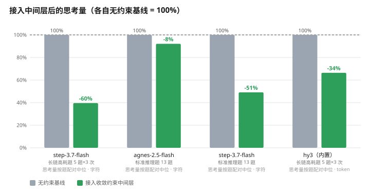
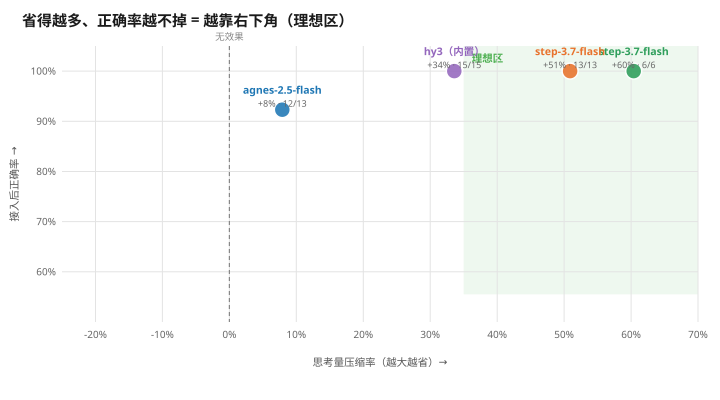

# No BB — Converge Middleware for Reasoning Models

English | [简体中文](README.md)

> **A thin layer between your app and an LLM API that automatically appends a
> "wrap it up when you know the answer" constraint to every conversation.**
> No model swap · No fine-tuning · No truncating the reasoning trace —
> measured savings of up to **74%** thinking tokens and **47%** lower latency,
> with zero accuracy loss.

| | |
|---|---|
| 🧠 Thinking volume | Standard reasoning problems **-51%** · long-chain problems **-33%** (up to **-74%** per problem, serial runs) |
| ⏱ Response time | Up to **-47%** wall-clock in serial runs (60.8s → 32.1s) |
| ✅ Accuracy | 42/42 → 42/42, **zero damage** (three independent problem sets) |
| 🔌 Integration cost | Clients change one line: `base_url`. Model name and API key unchanged |

---

## 1. Background: LLMs are thinking too much — on your dime

Reasoning models earn their quality by "think first, answer later". But nobody tells them
**when to stop thinking**. So they keep re-stating conclusions, re-verifying arithmetic,
and re-deriving things they already derived — every repetition burns real tokens and
real user wait time.

We measured three real open-ended long tasks (live API, real billing):

| Open-ended long task | Thinking volume | User wait |
|---|---|---|
| Five-year financial projection | **24,104 chars** | **118 s** |
| Multi-task schedule planning | **45,652 chars** | **266 s** |
| Probability derivation | **22,366 chars** | **114 s** |

Open the traces and you find a lot of this:

> "But why would the user ask which year it declined? Did I get something wrong?
> Oh, maybe it's... no, it isn't... Or maybe the user means... no...
> So the final result is... there is no declining year."

— The conclusion arrived long ago; the model is just checking itself over and over.

**Two key facts:**

1. **This is common behavior, not one model's quirk.** Across 9,815 real reasoning
   blocks on 13 models: the longer the thinking, the higher the repetition rate
   (17.5% for long blocks vs 0.48% for a shuffled baseline — structured repetition,
   not random noise).
2. **Users can't fix this themselves.** No real product can ask users to type
   "please think concisely" on every message — it must be done by the system.

## 2. Approach: don't touch the model, rewrite the request

### 2.1 Where it sits

```
user message ──► No BB middleware ──auto-appends constraint──► LLM API
   invisible ◄──── upstream response passed through verbatim ◄────┘
```

The middleware does exactly one thing: **before the request goes out, append a
"stop once concluded" behavioral constraint to the tail of the last user message.**
The response stream (including the reasoning trace) is passed through verbatim.

### 2.2 Three things it deliberately does not do

| Not doing | Why |
|---|---|
| **No model swap, no training** | Works with any model (model-agnostic), zero training cost |
| **No truncating / hiding thinking** | Hiding thinking ≠ less thinking — tokens still burn, time still passes, it's just invisible. We make the model **actually think less**, not think invisibly |
| **No user incantations** | The constraint is appended automatically; users never see it |

### 2.3 The constraint (this is the whole trick)

> (Additional instruction: please keep your reasoning concise. As soon as you reach
> a final conclusion, stop deriving further — do not restate the reasoning, do not
> self-check, do not add extra remarks; output the final answer directly.)

Selected as the best of 4 candidate constraints × 4 reasoning-effort levels in a
full-matrix evaluation (see Section 4).

## 3. Results

### 3.1 Summary table (every cell independently measured, reproducible)

| Scenario | Model | Thinking | Accuracy | Latency |
|---|---|---|---|---|
| Standard reasoning, 13 problems¹ | step-3.7-flash | **-50.9%** | 13/13 → **13/13** | -3.4%² |
| Long-chain, 5 problems × 3 runs³ | step-3.7-flash | **-33.3%** | 15/15 → **15/15** | -10.1%² |
| Long-chain serial timing, 2 problems × 3 runs⁴ | step-3.7-flash | **-46.6%** | 12/12 → **12/12** | **-19.5%** |
| Long-chain, 5 problems × 3 runs³ | hy3 (built-in channel) | **-33.6%** (real tokens) | 15/15 → **15/15** | — |
| Open-ended finance problem (single-problem A/B⁵) | step-3.7-flash | **-83%** (24,104 → 4,157 chars) | consistent within scope | **-82%** (118s → 21.6s) |

> ¹ GSM8K-style multi-step arithmetic (8) + hard long-chain problems (5), reasoning_effort=high, re-tested across all effort levels.
> ² Concurrent-load measurement; wall-clock polluted by queueing — reference only. Proof rows are the serial ones.
> ³ Problem sets with a single ground-truth answer (see 4.1); each problem run 3 times, median taken, to counter probabilistic constraint compliance.
> ⁴ **Serial, one call at a time** (no queueing pollution) clean wall-clock: L1 finance 9,753→2,507 chars (**-74%**), 60.8→32.1s (**-47%**); L2 critical path 1,826→975 chars (-47%), 30.8→24.8s (-19%).
> ⁵ Historical experiment: same open-ended finance problem, with/without constraint, single sample.

### 3.2 Charts

**Thinking volume (each unconstrained baseline = 100%, paired median per problem):**



**Compression × accuracy** (lower-right is better: save more, lose nothing):



### 3.3 Reading the numbers correctly

Long-chain compression (-33%) looks weaker than standard-problem compression (-51%).
That is not the product getting worse — **long-chain problems contain a higher share of
*necessary* derivation; only the redundant part can be cut**. The constraint removes
"self-restatement and re-checking after concluding", not "real thinking". So:

- The more verbose the scenario, the bigger the savings (open-ended finance: -83%);
- Models that already go straight to the answer leave nothing to save (see the agnes example in Section 5).

## 4. How we measured

### 4.1 Single-ground-truth principle

Early experiments used open-ended problems ("does cost grow by amount or by rate?"),
where the problem itself had ambiguous scope and the model produced two internally
consistent answers — **impossible to grade**. Lesson absorbed: every problem set in
this evaluation satisfies:

1. **A single, deterministic numeric answer** — the grader does ExactMatch on the
   number, tolerance max(0.01, 0.01%);
2. **All assumptions fixed in the problem statement** — no room for interpretation;
3. **Ground truth recomputed by an independent script** (`verify_long_answers.py`,
   decoupled from the problem text); if the script disagrees with the stated answer,
   the problem is barred from the set.

Example long-chain set (5 problems, all multi-step table-building derivations that
force long thinking chains, yet with unique answers):
five-year financial projection (1632.48) · critical-path scheduling (15) ·
inclusion–exclusion counting (200) · discount/tax/fee chain (3375) ·
flow-shop scheduling (19).

### 4.2 Coverage

- **3 models**: step-3.7-flash, agnes-2.5-flash (external APIs) + hy3 (built-in proxy channel)
- **Effort locked to high** (the worst case: user enables deep thinking, model at full power)
- **4 constraints × 4 effort levels** full matrix (104 cells) for selection;
  effect runs repeated 3× per problem against compliance randomness
- **Grading**: numeric ExactMatch, no human intervention

### 4.3 Measurement discipline (rules we set for ourselves)

- **Chars ≠ tokens, never mixed**: step/agnes report thinking characters; hy3 reports
  real thinking tokens. Absolute values are only listed per-model in tables;
  across models we compare relative change rates only;
- **Paired by problem, never pooled**: problems differ in difficulty by an order of
  magnitude; pooling medians mixes in the difficulty confounder (same data: pooled
  -16.5% vs paired -33.3% — a factor of two);
- **Medians, not single runs**: constraint compliance is probabilistic (same problem,
  single runs range 3.2k–28.8k chars). All conclusions use "3 runs × median per problem";
- **Full audit trail for grading flips**: the tolerance fix flipped 2 legitimately
  rounded samples (1632.48 answered as 1632.5); every flip is printed by
  `rejudge_long.py` for audit.

## 5. When NOT to use it (honest boundaries)

All three are measured, not guessed:

1. **Models that already think little → useless, possibly harmful.** agnes-2.5-flash
   baseline thinking was only 123 chars (the model already goes straight to the
   answer); with the constraint: -7.9% (no effect) and 1 of 13 problems failed.
   **Recommendation: route by baseline thinking length; do not enable for short chains.**
2. **Compliance is probabilistic — not -80% every time.** On average saves 33–51%;
   single runs may swing 3–80%. It is "a optimizer that saves half on average",
   not "a compressor that saves 80% every time".
3. **Keep self-checking for precise-numbers scenarios.** Cutting the post-conclusion
   self-check has produced arithmetic slips on long chains (769.824×1.08 mis-written
   as 831.00992, unnoticed by self-review). For finance/investment-grade precision,
   use the weakened constraint (keep "verify key calculations before stopping") —
   one-line switch via `REWRITE_SUFFIX_FILE`.

## 6. Quick start

```bash
# Start the middleware (default port 18772, optimal constraint built in)
python src/rewrite_proxy.py

# Clients only change base_url — model name and API key stay the same
#   before: base_url = "https://api.stepfun.com/v1"
#   after:  base_url = "http://127.0.0.1:18772/v1"
```

| Environment variable | Purpose |
|---|---|
| `REWRITE_SUFFIX_FILE=<path>` | Load constraint text from a file (e.g. weakened version for precise computation) |
| `REWRITE_ENABLED=0` | Pure passthrough, no constraint appended (A/B control) |
| `PORT` | Change port |

## 7. Verify the savings (quantify it after installing)

**Option 1: one-command A/B script (recommended)**

```bash
LLM_API_KEY=<the key you use for this model's vendor> \
python3 bench/verify_savings.py --model step-3.7-flash --question "any question you would actually ask"
```

The script sends the same question twice to the vendor directly and twice through the
middleware (alternating, same vendor endpoint), then reports median thinking chars
and wall-clock. An AI agent can run this command for you too.

```text
=== Result (median) ===
Thinking: 1914 -> 145 chars  (-92.4%)
Wall:     13.1s -> 1.4s      (-89.3%)
```

**Option 2: watch the log day-to-day (zero extra cost)**

```bash
tail -f data/rewrite_events.jsonl
```

One line per request: `reasoning_chars` = thinking chars for that call, `elapsed_ms`
= latency, `rewrote` = whether the constraint was appended. Over a few days, compare
long-request `reasoning_chars` against your pre-middleware baseline.

> Notes: ① real API billing is involved (2 calls per side minimum); ② constraint
> compliance is probabilistic — judge by medians, not single runs; ③ trivial questions
> save more; questions whose chains are already short leave nothing to save (see Section 5).

## 8. Reproducibility

Every number in this README can be regenerated by a script:

```bash
cd bench
python verify_long_answers.py      # independently recompute long-chain ground truths
python collect_builtin.py          # built-in-channel metrics (session jsonl → stats)
python rejudge_long.py             # re-grade + flip audit
python aggregate_paired.py         # per-problem paired aggregation (README's numbers)
python make_charts.py              # regenerate both charts
```

Raw evaluation data: `results/*.json`;
implementation details: [`docs/TECHNICAL.md`](docs/TECHNICAL.md).

---

*Evaluation executed 2026-09-05 ~ 09-06 with real, billed API calls; all data on disk and auditable.*
